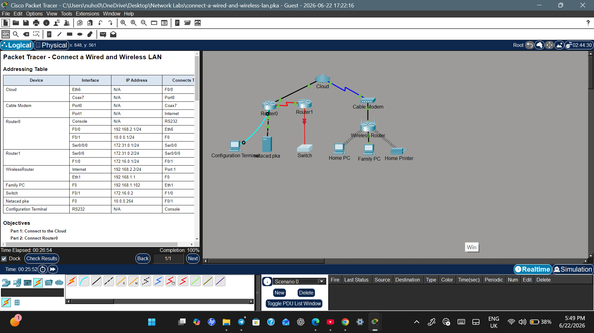
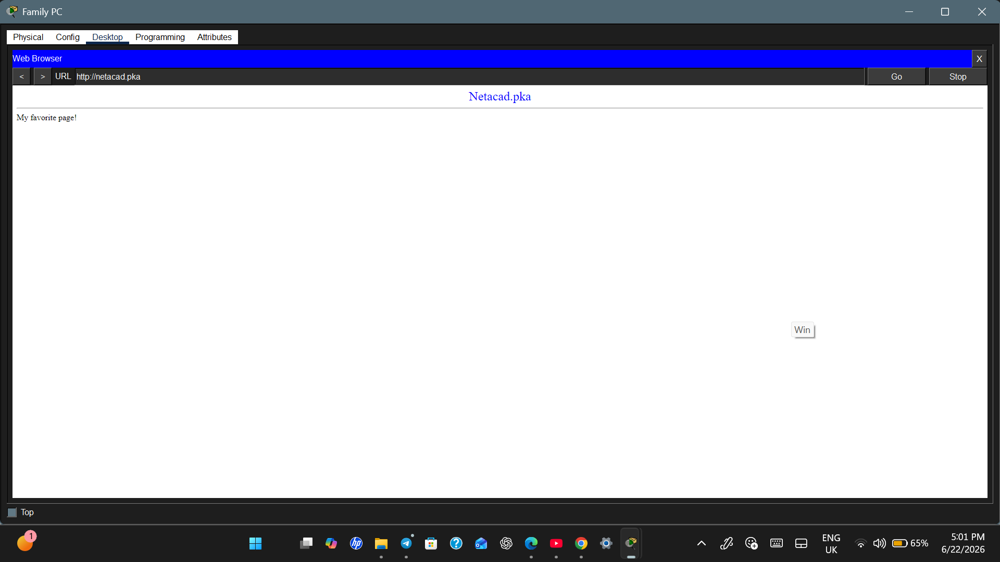

# Connect a Wired and Wireless LAN (Cisco Packet Tracer)

## 📌 Project Overview
This repository contains my configuration and successful implementation of the **"Connect a Wired and Wireless LAN"** Cisco Packet Tracer lab. The objective was to establish reliable end-to-end connectivity across various networking media, including wired, wireless, and fiber-optic infrastructures.

---

## 🛠️ Key Troubleshooting & Technical Insights

During the deployment, I successfully diagnosed and resolved a critical media connectivity issue:

* **The Challenge:** Attempting to connect `Router1` to the `Switch` using standard copper cabling resulted in an incorrect connection error, as the designated link interfaces required specialized media types.
* **The Solution (Media Selection):** By carefully analyzing the hardware port specifications on the switch, I determined that a high-speed backbone connection was required. I replaced the copper line with a **Fiber Optic Cable** (Yellow). This instantly brought the interface protocols up, enabling proper data transmission across the network.

---

## 🚦 Verification & Video Demonstration

### 🎥 Project Walkthrough Video
*Below is the video demonstration explaining the network topology, the troubleshooting process, and testing the end-to-end connection:*

(https://github.com/Nuha56/connect-a-wired-and-wireless-lan/blob/main/Lab.demo.mp4)

---

## 📸 Lab Previews

### 1. Network Topology
The complete wired and wireless network layout running smoothly with active protocols:

### 2. End-to-End Connectivity Verification
Successful HTTP request from the `Family PC` browser reaching the web server at `netacad.pka`:

